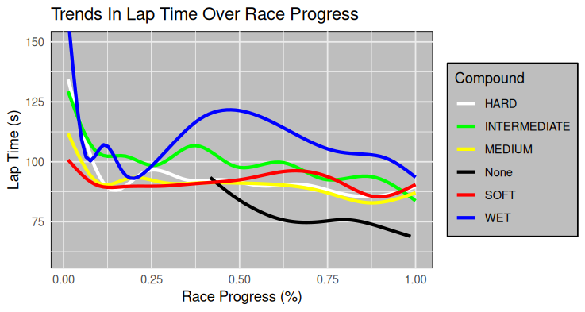

# R-Final-Project
R final project for the MTECH data technology course

## This code shows us the averave change in lap time from the previous lap for drivers who made a pit stop.
df %>% 
  filter(PitStop == 1) %>% 
  summarise(avg_positions_lost <- mean(LapTime_Delta, na.ra=T))
### On average a drivers lap time will increase by 0.362 seconds if they make a pitstop.

## This code shows the average lap time delta by compound taken from racers in the top 10 positions.
df %>% 
  filter(Position <= 10) %>% 
  group_by(Compound) %>% 
  summarise(avg_tire_deg = mean(LapTime_Delta, na.ra=T))
### This is the output: 
  Compound     avg_tire_deg
  <chr>               <dbl>
1 HARD                0.339
2 INTERMEDIATE        3.25 
3 MEDIUM             -0.600
4 None              -17.1  
5 SOFT               -1.65 
6 WET                12.6  
### This can help us know what average laptimes to expect when using a certain type of compound.

## Using a 2 tailed T-Test we will test to see if a driver making a pit stop is related to the lap number.
## Null Hypothesis: If a driver makes a pit stop it does not effect what lap number they pitted on.
## Alternative Hypothesis: If a driver makes a pit stop it will effect what lap number they pitted on.

as.character(df$PitStop)
alpha = 0.05
results <- t.test(LapNumber ~ PitStop, data=df)
p <- results$p.value
if(p <= alpha){
  print("Rejected")
} else {
  print("Failed to reject")
}

### The null hypothesis was rejected, this means that there is a relationship bettween a driver making a pit stop and the lap number they pitted at.
### Finding the trend in that relationship can help to predict other teams pit stop window.

